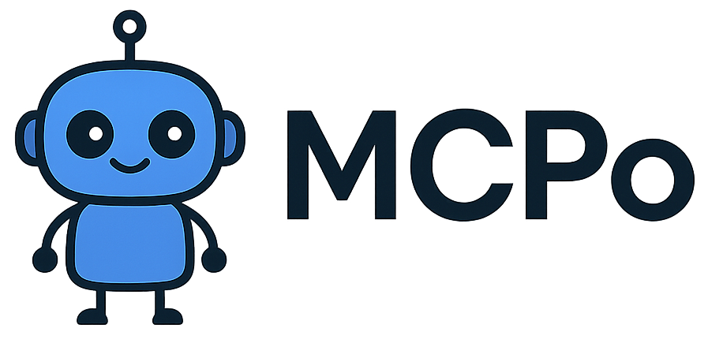

# MCP (Model Context Protocol) Server



A MCP server that provides a unified interface for interacting with multiple services, currently supporting GitHub, Azure Log Analytics, Google, Azure OpenAI, Azure Vision, PostgreSQL, and more.

## 🔧 Features

### GitHub Integration
- **File/Folder Access**: Retrieve files or directory listings from GitHub repositories
- **Workflow Monitoring**: Fetch recent workflow runs and their statuses
- **Code Search**: Search for code across repositories
- **Repository Structure**: Get the complete file structure of a repository
- **Commit History**: View commit history with optional file filtering
- **Commit Diffs**: Inspect file-level changes for specific commits

### Azure Integration
- **Log Analytics Querying**: Run Kusto Query Language (KQL) queries against Azure Log Analytics workspaces
- **Secure Authentication**: OAuth2 client credentials flow for secure API access

### Utilities
- **Timestamp Generation**: Get current UTC timestamp with microsecond precision
- **Website Content**: Get the content of a website in Markdown format

### Database Integration
- **Database Reading**: Read a database from a PostgreSQL server

> ⚠️ Use a DB user with `SELECT`-only privileges

### Google Integration
- **Google Search**: Search Google for a query
- **YouTube Search**: Search YouTube for a query
- **YouTube Transcript**: Get the transcript of a YouTube video

### Azure Vision Integration
- **Image Analysis**: Get the analysis of an image

### LLM Integration
- **Azure OpenAI**: Get a response from Azure OpenAI

## 📦 Prerequisites

- Python 3.8+
- Docker (optional)
- Tokens & credentials:
  - GitHub PAT (`repo` scope)
  - Azure AD App: client ID, secret, tenant ID
  - Azure OpenAI Key & Endpoint
  - Azure Vision Key & Endpoint
  - PostgreSQL credentials

## Installation

1. Clone the repository:
   ```bash
   git clone https://github.com/DrFloflo/MCP-github.git
   ```

2. Install dependencies:
   ```bash
   pip install -r requirements.txt
   ```

3. Create a `.env` file in the project root with the following variables:
   ```env
   # GitHub Configuration
   GITHUB_TOKEN=your_github_token
   
   # Azure Configuration
   AZURE_CLIENT_ID=your_client_id
   AZURE_CLIENT_SECRET=your_client_secret
   AZURE_TENANT_ID=your_tenant_id

   # Azure OpenAI Configuration
   AZURE_OPENAI_ENDPOINT=your_azure_openai_endpoint
   AZURE_OPENAI_KEY=your_azure_openai_key
   AZURE_OPENAI_API_VERSION=your_azure_openai_api_version

   # Azure Vision Configuration
   VISION_ENDPOINT=your_vision_endpoint
   VISION_KEY=your_vision_key

   # Database Configuration
   POSTGRES_HOST=your_postgres_host
   POSTGRES_PORT=your_postgres_port
   POSTGRES_DB=your_postgres_db
   POSTGRES_USER=your_postgres_user
   POSTGRES_PASSWORD=your_postgres_password
   
   ```

## 🔐 Token Setup

### GitHub

1. Go to [GitHub Personal Access Tokens](https://github.com/settings/tokens)
2. Generate a new token with the `repo` scope
3. Add this to your `.env` file:

### Azure AD (Log Analytics)

1. Register a new app in [Azure Active Directory](https://portal.azure.com/#view/Microsoft_AAD_RegisteredApps/ApplicationsListBlade)
2. Copy the following:
   - Tenant ID (Directory ID)
   - Client ID (Application ID)
   - Create and copy a new client secret (under *Certificates & secrets*)
3. Add to `.env`:
   ```env
   AZURE_TENANT_ID=your_tenant_id
   AZURE_CLIENT_ID=your_client_id
   AZURE_CLIENT_SECRET=your_client_secret
   ```

### Log Analytics Workspace

1. Go to your Log Analytics Workspace in Azure
2. Copy your **Workspace ID**
3. Ensure your Azure AD Application has access:
   - Go to your app in Azure AD
   - Navigate to **API Permissions**
   - Click **Add a permission**
   - Choose **Microsoft Graph** > **Delegated permissions**
   - Select `User.Read` and confirm

### Azure OpenAI

1. Go to your Azure OpenAI resource (or Foundry)
2. Copy the endpoint and key
3. Add this to `.env`:
   ```env
   AZURE_OPENAI_ENDPOINT=your_azure_openai_endpoint
   AZURE_OPENAI_KEY=your_azure_openai_key
   AZURE_OPENAI_API_VERSION=your_azure_openai_api_version
   ```

### Azure Vision

1. Go to your Azure Vision resource (or Vision)
2. Copy the endpoint and key
3. Add this to `.env`:
   ```env
   VISION_ENDPOINT=your_vision_endpoint
   VISION_KEY=your_vision_key
   ```

### PostgreSQL

1. Go to your PostgreSQL server
2. Copy the host, port, database, user, and password
3. Add this to `.env`:
   ```env
   POSTGRES_HOST=your_postgres_host
   POSTGRES_PORT=your_postgres_port
   POSTGRES_DB=your_postgres_db
   POSTGRES_USER=your_postgres_user
   POSTGRES_PASSWORD=your_postgres_password
   ```

## Usage

### Running the Server

```bash
python server.py
```

The server will start on `http://0.0.0.0:6277` by default.

### Docker

Build the Docker image:
```bash
docker build -t mcp-server .
```

Run the container:
```bash
docker run -p 6277:6277 --env-file .env mcp-server
```

## 🧰 Available API Tools

### GitHub Tools

- `get_github_file_folder`: Get file contents or list directories
- `get_workflow_runs`: Retrieve recent workflow runs
- `search_codebase`: Search code across repositories
- `get_file_structure`: Get complete repository structure
- `get_commit_history`: View commit history
- `get_commit_diff`: View file-level changes in a commit

### Azure Tools

- `run_log_analytics_query`: Execute KQL queries against Azure Log Analytics

### PostgreSQL Tools

- `read_db`: Query data from PostgreSQL

> ⚠️ Use a database user with **read-only** (`SELECT`) access

### Google Tools

- `search_google`: Search Google for any query
- `search_youtube`: Search YouTube videos
- `get_youtube_transcript`: Get transcript from a YouTube video

### Azure Vision Tools

- `get_image_analysis`: Analyze image content using Azure Vision

### Azure OpenAI Tools

- `get_azure_openai_response`: Generate response using Azure OpenAI (LLM)

### Utility Tools

- `get_current_utc_timestamp`: Get the current UTC timestamp
- `get_website_content`: Fetch and convert website HTML to Markdown

### Code Tools

- `execute_python_code`: Execute a Python code snippet securely